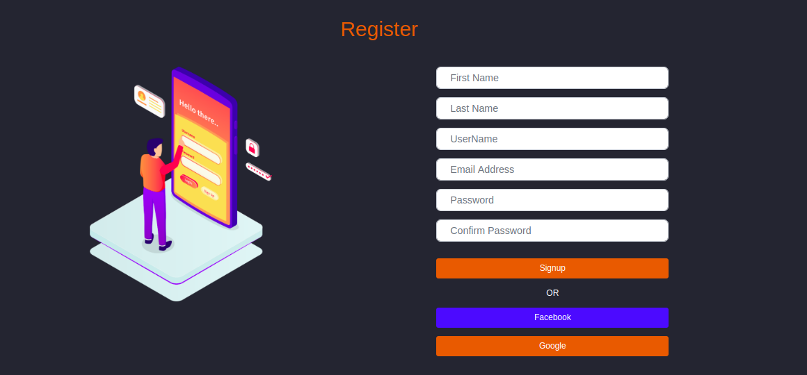
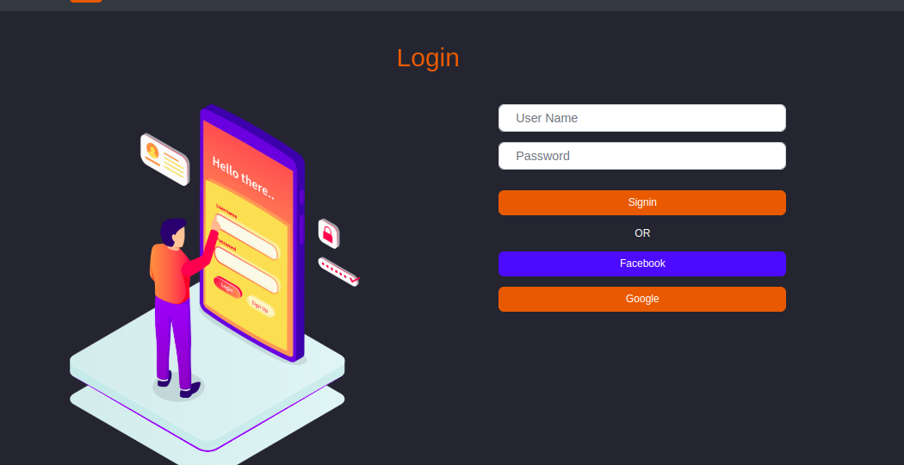
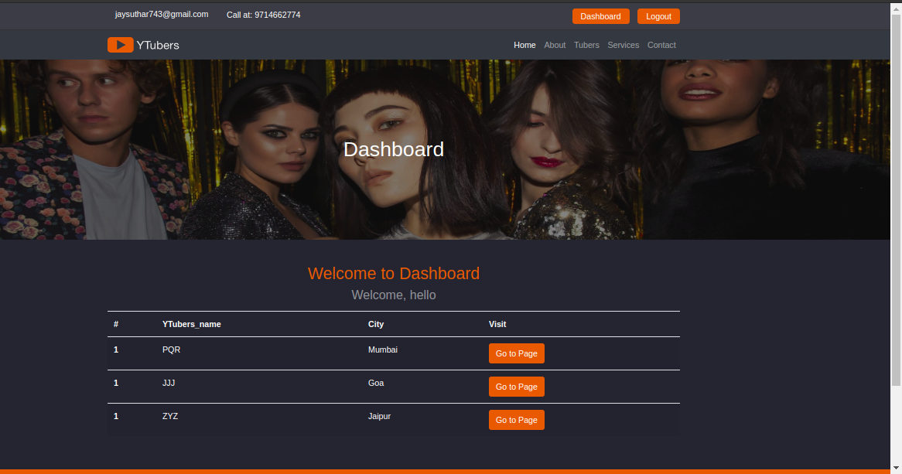
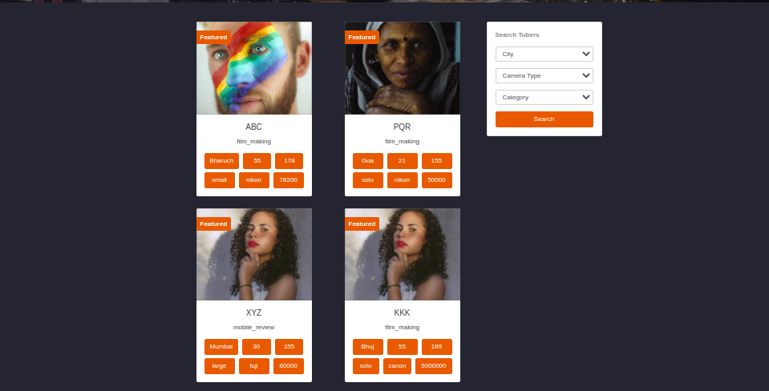
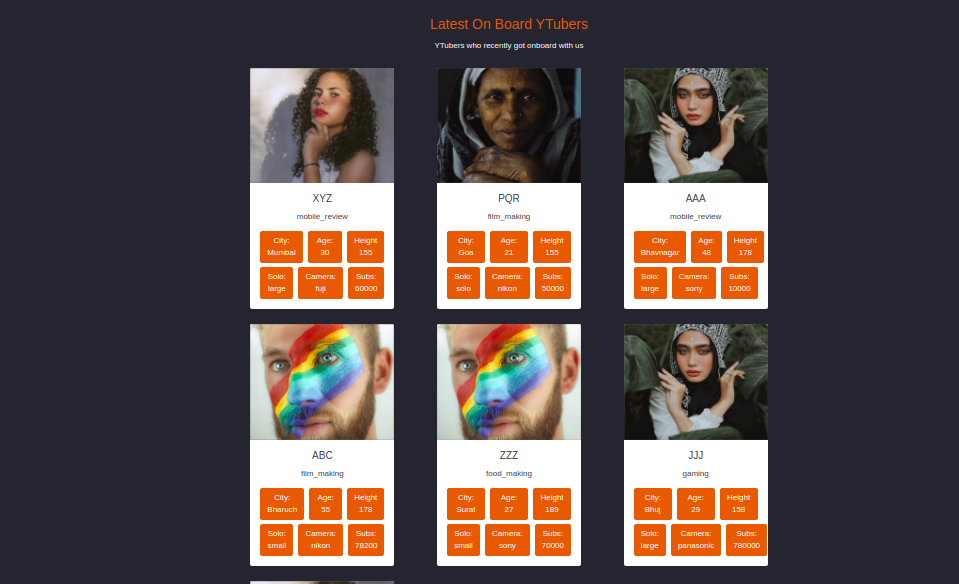
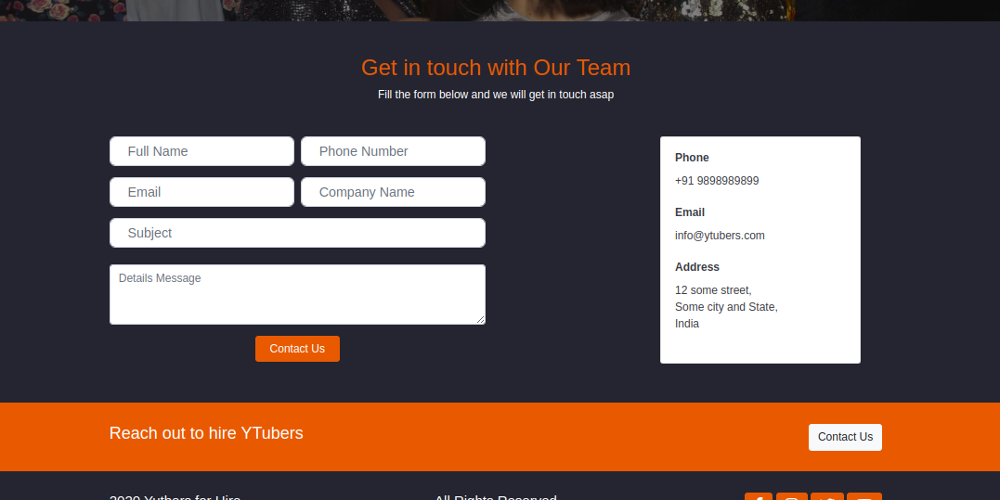
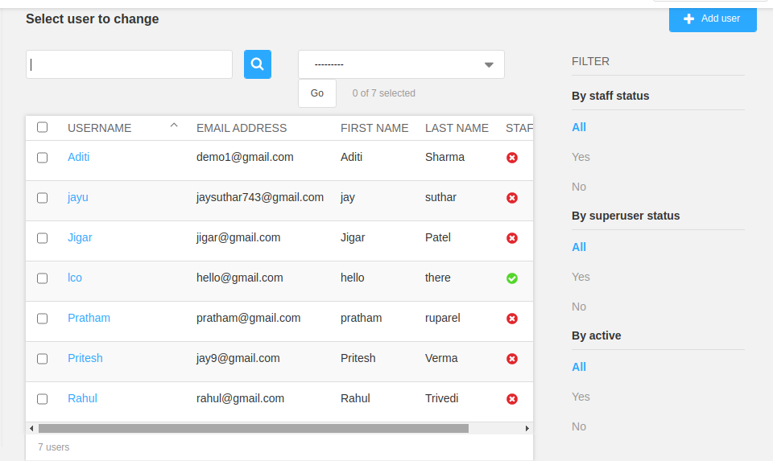
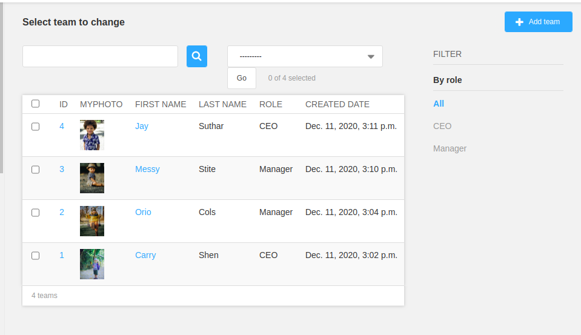
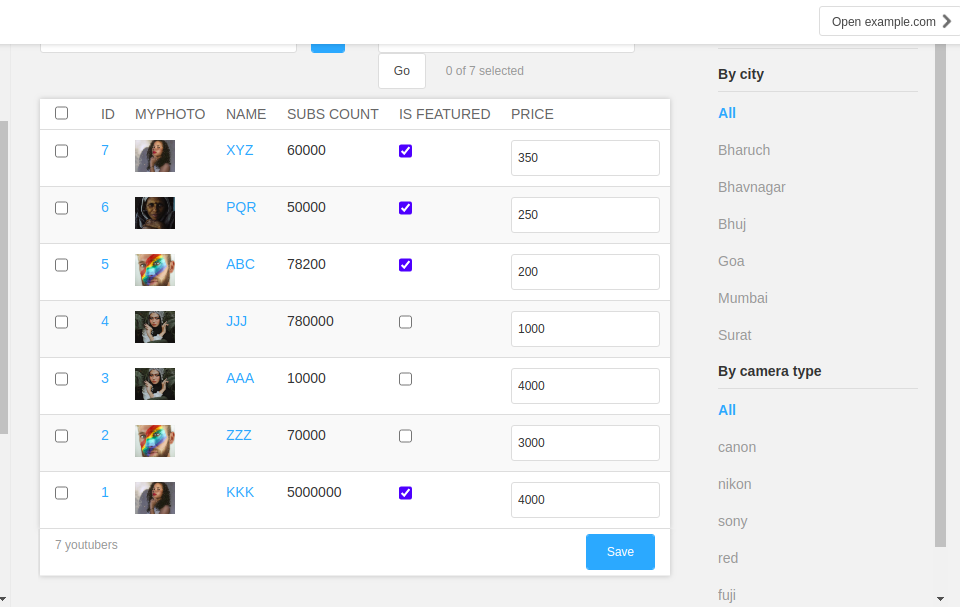

# Ytubers
Hire Your favorite Youtuer.

### Objectives:

The objective of this Project is to understand django structure, views, models, and templats.

### Features:

* Google, Facebook authentication to regiter account.
* Monitor your hired Youtuers.
* Hire Youtuer by submmiting form. 
* Detailed view of Individual Youtuber.
* Contact Team.
* Every Module has its separate Model.

### Tools & Technology:

* Programming Language: Python3
* Framework: Django 3.1.4
* Operating System: Ubuntu 18.04.3 
* Database: postgresql
* Editor: VSCode

### Screen Layout

#### (Due to copyright issue, i have taken Random names and Random photos)

 

 

 

 

 

 

 

 

 

